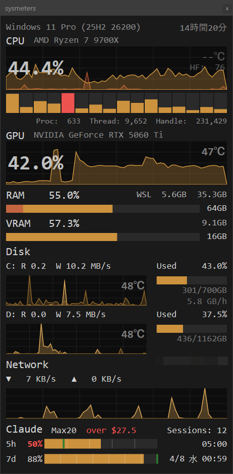

# sysmeters

Windows 11 用リアルタイムシステムリソース監視 HUD アプリケーション。

CPU、GPU、メモリ、ディスク I/O、ネットワーク通信量に加え、  
**Claude Code のレートリミット使用状況をコンパクトなオーバーレイ GUI でモニタリングする。**



## 機能

- **CPU**：全体使用率（面グラフ）+ 論理コア別使用率（縦バー 16 本）+ 温度（横バー）
- **GPU**：使用率（面グラフ）+ 温度（横バー）、NVIDIA NVML 経由
- **RAM**：使用率（横バー）+ 使用量/総量
- **VRAM**：使用率（面グラフ）+ 使用量/総量、NVIDIA NVML 経由
- **Disk I/O**：C: / D: パーティション別、Read/Write 分離（面グラフ + MB/s）
- **Network**：全 NIC 合算、送信/受信分離（面グラフ + KB/s or MB/s）
- **IP**：グローバル IP アドレス表示（5 分ごとに取得、オフライン時は OFFLINE📵）
- **Claude Code**：5h / 7d レートリミット使用率（横バー）+ リセット時刻、セッション数。横バー上の緑の縦線は均等消費ペースマーカー（リセットまでの残り時間で均等に消費した場合の理想消費位置）

Direct2D による GPU アクセラレーション描画で滑らかな表示を実現。

## インストール

[Scoop](https://scoop.sh/) でインストールできる。

```powershell
scoop bucket add aviscaerulea https://github.com/aviscaerulea/scoop-bucket
scoop install sysmeters
```

## 実行

```
out\sysmeters.exe
```

タスクトレイ（通知領域）にアイコンが表示される。右クリックで設定ファイルを開くか終了できる。

## 設定

`sysmeters.toml` で外観（背景色、グラフ色）等をカスタマイズできる。

## 動作要件

- Windows 11（64bit）
- CPU 温度を表示するには **PawnIO ドライバ**のインストールが必要（`winget install namazso.PawnIO`）

## ビルド

```powershell
# 依存ライブラリの取得（初回のみ）
pwsh.exe scripts/fetch-deps.ps1

# ビルド
task build

# リリースビルド（zip パッケージング）
task release
```
